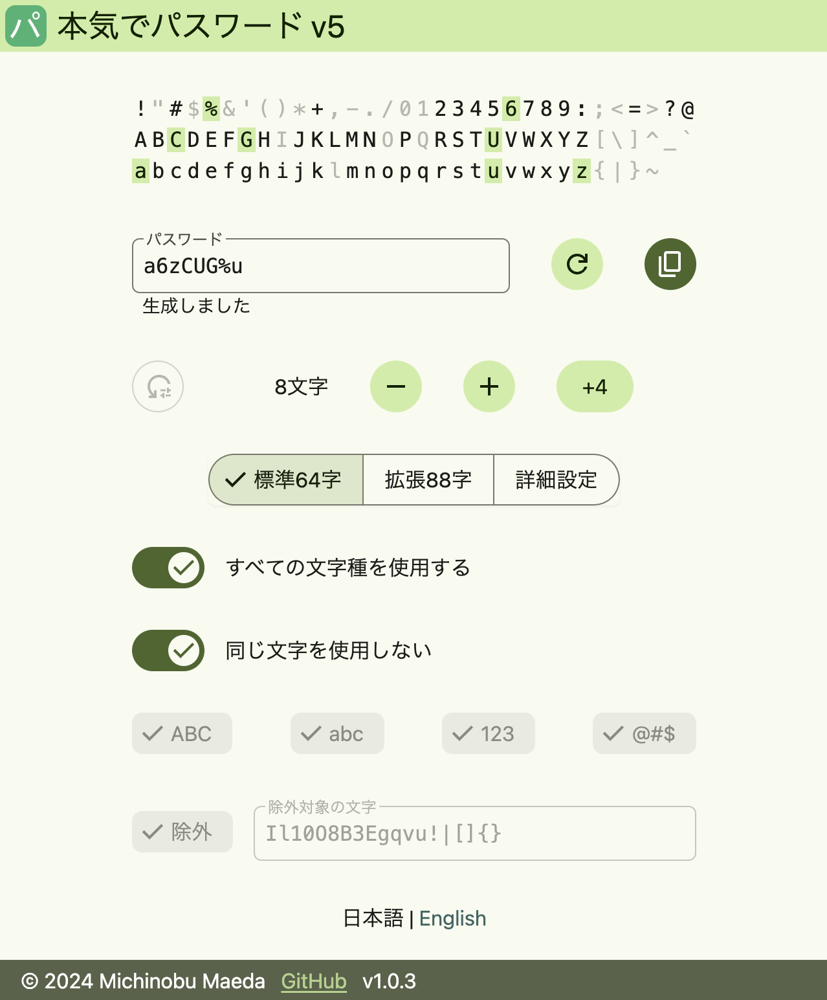

# Honkipass v5

Sample: https://honkipass.michinobu.jp/



## Prerequisites

-   node >= 20

## Build

```bash
git clone git@github.com:MichinobuMaeda/honkipass5.git
cd honkipass5
npm install
npm run build
npm start
```

## Note

```bash
$ npm create @vite-pwa/pwa@latest

✔ Project name: … vite-pwa-sample
✔ Select a framework: › Svelte
✔ Select a variant: › JavaScript
✔ PWA Name: … vite-pwa-sample
✔ PWA Short Name: … vite-pwa-sample
✔ PWA Description: …
✔ Theme color: … #4C662B
✔ Select a strategy: › injectManifest
✔ Select a behavior: › Prompt for update
✔ Enable periodic SW updates? … yes
✔ Show offline ready prompt? … no
✔ Generate PWA Assets Icons on the fly? … yes
```

Copy some svelte components from <https://github.com/MichinobuMaeda/coarse-paper>
